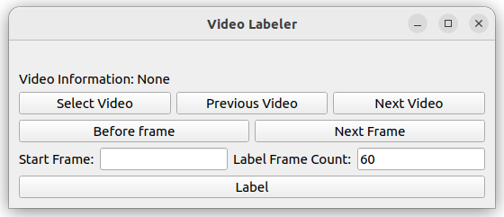

# Video-time-annotation
Video trimming annotation  
1st project  
for video annotation 2023.12.12  

This is for video labeling. 
I can't not find light labeling program for my work. 
And many labeling programs working in Ubuntu environment. 
so I make this for windows OS. 

# How to use

### 01_labeling.py

Run the 01_labling.py with python. 
Select video file. Usually the first file in the directory is preferred. 
You can see your video information and choose frame what you want to labeling. 
When press Label button number of 'label frame count' frames labeled as 1 from the start frame.  
And the others labeled as 0.  
labeled data saved as .json in same directory with video.  

#### short cut
"Q" : Previous frame  
"E" : Next frame  
"I" : Previous video  
"P" : Next video  
"O" : Press "Label" button, present video labeled  

##### The default input for Label Frame Count is se to 60.

#### 01_2_labeling_start_end.py

01_2 is developed version for labeling. 
Tow short cut key is added.
"K" : Fill Start frame  
"L" : Fill end frame  

### 02_extract_labeled_video.py  

You need to change two parts.  
One is the 'root folders' and the 'speed list.'  
'Root folders' refer to your labeled videos directory,  
and 'speed' refers to the subdirectory of your video's root directory.  
Then, your videos will be extracted only if they are labeled as '1'.

### 03_making_48frames.py

This is for making your extracted vidoes as 48 frames each.
You can modify it according to your needs.

### 04_rough_preprocessing.py

This is for separating 48-frame videos into multiple segments.  
You can customize it according to your requirements,  
such as dividing them in half or into three or more parts.

### make_images.py and video_compress.py

make_images.py : This script is used to convert videos into images.  
video_compress.py : This script is designed for compressing videos.  
When using labeling.py, you may experience latency issues with large vidoes.  
To detour this latency problem, you can compress videos to a lower quality, enalbing faster labeling.  
The labeling data (.json)files can also be used with uncompressed videos.